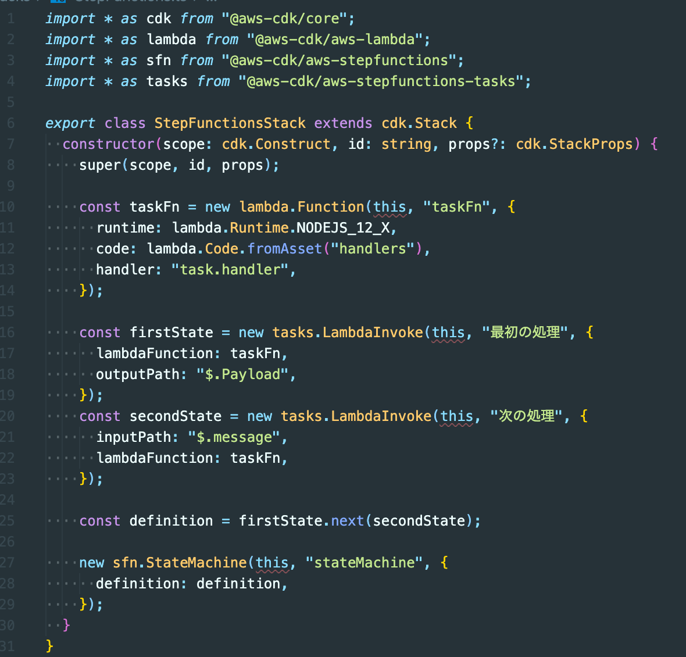

# Welcome to your CDK TypeScript project!

This is a blank project for TypeScript development with CDK.

The `cdk.json` file tells the CDK Toolkit how to execute your app.

## Useful commands

- `npm run build` compile typescript to js
- `npm run watch` watch for changes and compile
- `npm run test` perform the jest unit tests
- `cdk deploy` deploy this stack to your default AWS account/region
- `cdk diff` compare deployed stack with current state
- `cdk synth` emits the synthesized CloudFormation template

## トラブルシューティング

`@aws-cdk` のパッケージのバージョンが合っていないと、`this` を渡したときにエラーになる…。



```
Argument of type 'this' is not assignable to parameter of type 'Construct'.
```

```
"devDependencies": {
    "@aws-cdk/assert": "1.24.0",
    "@aws-cdk/aws-lambda": "^1.61.1",
    "@aws-cdk/aws-stepfunctions": "^1.61.1",
    "@aws-cdk/aws-stepfunctions-tasks": "^1.61.1",
    "@types/jest": "^24.0.22",
    "@types/node": "10.17.5",
    "aws-cdk": "1.24.0",
    "jest": "^24.9.0",
    "ts-jest": "^24.1.0",
    "ts-node": "^8.1.0",
    "typescript": "~3.7.2"
  },
  "dependencies": {
    "@aws-cdk/core": "1.24.0",
    "source-map-support": "^0.5.16"
  }
```
